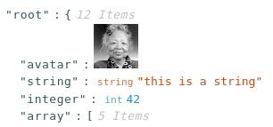
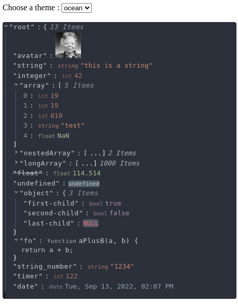

# @textea/json-viewer

[](https://www.npmjs.com/package/@textea/json-viewer)
[](https://www.npmjs.com/package/@textea/json-viewer)
[](https://github.com/TexteaInc/json-viewer/blob/main/LICENSE)
[](https://codecov.io/gh/TexteaInc/json-viewer)
[](https://viewer.textea.io)

`@textea/json-viewer` is a React component that can be used to view and display any kind of data, not just JSON.

~~Json Viewer?~~
**ANY Data Viewer** ✅

[](https://stackblitz.com/edit/textea-json-viewer-v3-b4wgxq?file=pages%2Findex.js)

## Features 🚀

- 🦾 100% TypeScript
- 🎨 Customizable: Key, value, editable, copy, select... Anything you can think of!
- 🌈 Theme support: light or dark, or use [Base16](https://github.com/chriskempson/base16) themes.
- ⚛️ SSR Ready
- 📋 Copy to Clipboard
- 🔍 Inspect anything: `Object`, `Array`, primitive types, and even `Map` and `Set`.
- 📊 Metadata preview: Total items, length of string...
- ✏️ Editor: Comes with an editor for basic types, which you can also customize to fit your use case.

## Installation

`@textea/json-viewer` is using [Material-UI](https://mui.com/) as the base component library, so you need to install it and its peer dependencies first.

```sh
npm install @textea/json-viewer @mui/material @emotion/react @emotion/styled
```

### CDN

```html
<!DOCTYPE html>
<html lang="en">
  <body>
    <div id="json-viewer"></div>
    <script src="https://cdn.jsdelivr.net/npm/@textea/json-viewer@3"></script>
    <script>
      new JsonViewer({
        value: {
          /* ... */
        }
      }).render('#json-viewer')
    </script>
  </body>
</html>
```

## Usage

Here is a basic example:

```jsx
import { JsonViewer } from '@textea/json-viewer'

const object = {
  /* my json object */
}
const Component = () => <JsonViewer value={object} />
```

### Customization

You can define custom data types to handle data that is not supported out of the box. Here is an example of how to display an image:

```jsx
import { JsonViewer, defineDataType } from '@textea/json-viewer'

const object = {
  image: 'https://i.imgur.com/1bX5QH6.jpg'
  // ... other values
}

// Let's define a data type for image
const imageDataType = defineDataType({
  is: (value) => typeof value === 'string' && value.startsWith('https://i.imgur.com'),
  Component: (props) => <Image height={50} width={50} src={props.value} alt={props.value} />
})

const Component = () => <JsonViewer value={object} valueTypes={[imageDataType]} />
```



[see the full code](docs/pages/full/index.tsx)

## Theme

Please refer to [Styling and Theming](https://viewer.textea.io/how-to/styling)



## Contributors

<a href="https://github.com/TexteaInc/json-viewer/graphs/contributors"></a>

## Acknowledge

This package is originally based on [mac-s-g/react-json-view](https://github.com/mac-s-g/react-json-view).

Also thanks open source projects that make this possible.

## Sponsoring services


[Netlify](https://www.netlify.com/) lets us distribute the [site](https://viewer.textea.io).

## LICENSE

This project is licensed under the terms of the [MIT license](LICENSE).
