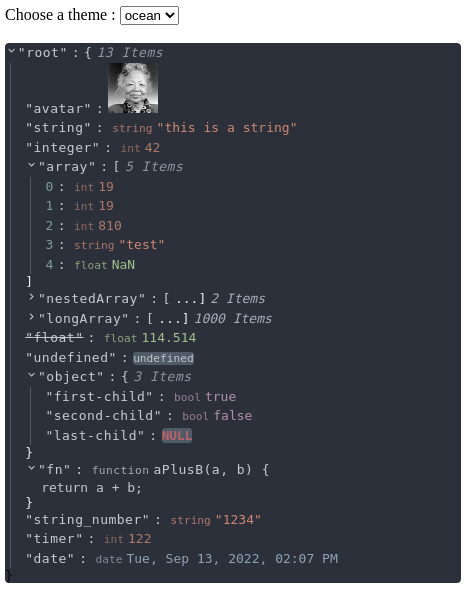

# @textea/json-viewer

[](https://www.npmjs.com/package/@textea/json-viewer)
[](https://github.com/TexteaInc/json-viewer/blob/main/LICENSE)
[](https://codecov.io/gh/TexteaInc/json-viewer)
[](https://viewer.textea.io)

This is a React component for JSON viewer, but not only a JSON viewer.

~~Json Viewer?~~
**ANY Data Viewer** ✅

> This is v2 branch with fancy features like 100% TypeScript, lightly code and customizable component support.
>
> If you are looking for v1 version based on [mac-s-g/react-json-view](https://github.com/mac-s-g/react-json-view),
> Please see [v1.x](https://github.com/TexteaInc/json-viewer/tree/v1.x).

[](https://stackblitz.com/edit/textea-json-viewer-v2?file=pages%2Findex.js)

## Usage

```shell
# npm
npm install @textea/json-viewer
# yarn
yarn add @textea/json-viewer
# pnpm
pnpm add @textea/json-viewer
```

### Type Declaration

see [src/type.ts](src/type.ts)

### Basic Example

```tsx
import JsonViewer from '@textea/json-viewer'

const object = { /* my json object */ }
const Component = () => (<JsonViewer value={object}/>)
```

### Customizable data type

```tsx
import JsonViewer from '@textea/json-viewer'

const object = {
  // what if I want to inspect a image?
  image: 'https://i.imgur.com/1bX5QH6.jpg',
  // ... other values
}
const Component = () => (
  <JsonViewer
    value={object}
    // just define it
    valueTypes={[
      {
        is: (value) =>
          typeof value === 'string' &&
          value.startsWith('https://i.imgur.com'),
        Component: (props) => {
          return ;
        },
      },
    ]}
  />
)
```


[see the full code](examples/basic/pages/index.tsx)

### Base 16 Theme Support

```tsx
export const ocean: NamedColorspace = {
  scheme: 'Ocean',
  author: 'Chris Kempson (http://chriskempson.com)',
  base00: '#2b303b',
  base01: '#343d46',
  base02: '#4f5b66',
  base03: '#65737e',
  base04: '#a7adba',
  base05: '#c0c5ce',
  base06: '#dfe1e8',
  base07: '#eff1f5',
  base08: '#bf616a',
  base09: '#d08770',
  base0A: '#ebcb8b',
  base0B: '#a3be8c',
  base0C: '#96b5b4',
  base0D: '#8fa1b3',
  base0E: '#b48ead',
  base0F: '#ab7967'
}

const Component = () => (
  <JsonViewer
    value={object}
    theme={ocean}
  />
)
```




## Features

- [X] 100% TypeScript
- [X] Customizable
  - [X] `keyRenderer` for customize key renderer
  - [X] `valueTypes` for customize any value types you want
  - [X] `light | dark | base16` Theme support
  - [ ] custom metadata
- [X] Support `Next.js` SSR
- [X] `onChange` props allow users to edit value
- [X] Inspect `object`, `Array`, primitive type, even `Map` and `Set` by default.
- [X] Metadata preview, like total items, length of string...
- [X] `Copy to Clipboard` on Click
- [ ] Editor for basic types
- [ ] Fully Test Coverage

## Acknowledge

This package is originally based on [mac-s-g/react-json-view](https://github.com/mac-s-g/react-json-view)

## LICENSE

This project is licensed under the terms of the [MIT license](LICENSE).
